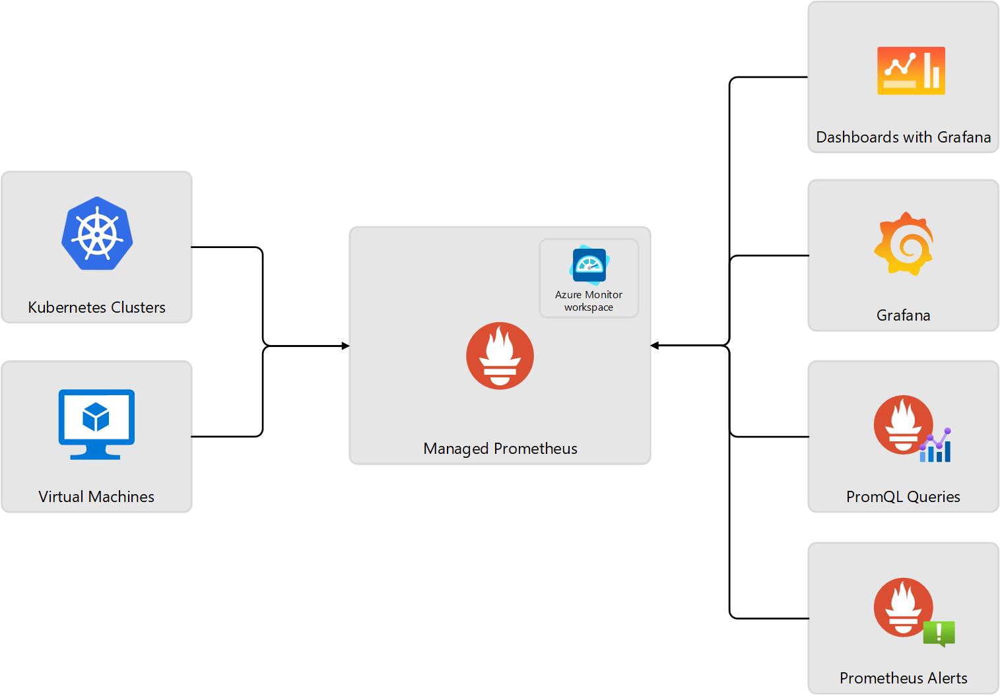

# AKS Observability Guide

This guide provides comprehensive instructions for implementing observability in Azure Kubernetes Service (AKS) clusters using Azure Monitor, including logs, metrics, and visualization components.

## 🚀 Quick Start Options

**Choose your path:**

1. **Manual Commands**: Follow [Complete Observability Setup](#complete-observability-setup)
2. **Detailed Guide**: Continue reading this document for step-by-step instructions

## 📚 Additional Resources

- **[evolution.md](evolution.md)** - Comprehensive history of logging evolution from bare metal to Kubernetes

## Table of Contents

- [Prerequisites](#prerequisites)
- [Environment Variables Setup](#environment-variables-setup)
- [Complete Observability Setup](#complete-observability-setup)
  - [Verify Complete Setup](#verify-complete-setup)
- [Overview](#overview)
- [Azure Monitor Components](#azure-monitor-components)
- [Monitoring Data Types](#monitoring-data-types)
  - [Activity Logs](#activity-logs)
  - [Platform Metrics](#platform-metrics)
  - [Resource Logs](#resource-logs)
  - [Syslog](#syslog)
  - [Container Insights](#container-insights---logs-from-pod-stdoutstderr)
  - [Azure Monitor Workspace](#azure-monitor-workspace---metrics-from-workloads)
- [Azure Managed Grafana](#azure-managed-grafana)

---


## Monitoring Data Types

---

### Activity Logs

Activity logs provide audit trail information for AKS cluster management operations. The Azure Monitor activity log automatically collects some data for AKS clusters at no cost. These log files track information like when a cluster is created or changes are made to a cluster configuration.

Viewing data: Use log analytics queries. 

**Documentation:**
- https://learn.microsoft.com/en-us/azure/aks/monitor-aks-reference#activity-log  
- https://learn.microsoft.com/en-us/azure/role-based-access-control/permissions/containers#microsoftcontainerservice  

---

### Platform Metrics

Platform metrics are automatically collected for AKS clusters at no cost. It includes a subset of control plane metrics. 

Viewing data: You can analyze these metrics by using the metrics explorer.  Data source is not directly exposed to the customer. Use tools provided such as Azure Monitor Metrics Explorer, Workbooks, Grafana (via Azure Monitor Plugin) to view the data. 
s
Alerts:  Use platform metrics to create metric alerts.


**Documentation:**
- https://learn.microsoft.com/en-us/azure/aks/monitor-aks-reference#metrics  
- https://learn.microsoft.com/en-us/azure/aks/monitor-aks-reference#supported-metrics-for-microsoftcontainerservicemanagedclusters   

**Baseline Metrics:**
Refer AMBA for baseline metrics to monitor and alert   
https://azure.github.io/azure-monitor-baseline-alerts/services/ContainerService/managedClusters/  

---

### Resource Logs - Logs from Control Plane     

Resource logs capture information from the Microsoft managed AKS control plane components.  

Viewing data: 
Use log analytics queries.   

---

### Resource Metrics - Metrics from Control Plane     

Besides out of the box 'control plane metrics' through Azure Monitor platform metrics, this feature gives you visibility into the availability and performance of critical control plane components like the API server, etcd, the scheduler, the autoscaler, and the controller manager in AKS.    


Viewing data: 
Use PromQL (using AMW)and AMG.   

---


### Dataplane Logs - Logs from Worker nodes, pods

Container insights collects various logs and performance data from a cluster and stores them in a Log Analytics workspace and in Azure Monitor Metrics. 

Viewing data:  
Log data: Container Insights supports viewing/analyzing data like stdout and stderr streams by using views and workbooks in Container insights 
Metrics data: Metrics explorer. 

Log data can also be viewed via Log analytics.   

---


### Dataplane Metrics - Metrics from Worker nodes, pods

When prometheus metrics scraping enabled, AKS managed/installed agents collects/scrapes Prometheus metrics from the default targets. Metrics data is sent to "Azure Monitor managed service for Prometheus".  This is also called "Azure Managed Workspace".  This managed services provides high availability, service-level agreement (SLA) guarantees, automatic software updates, and a highly scalable metrics store that retains data for up to 18 months.

Viewing data:  
Metrics data: AMW supports PromQL.  Alternatively, when linked with Azure Managed Grafana, it enables 'comprehensive monitoring capability'.   
Metrics data: Metrics explorer. 



Reference:   
https://learn.microsoft.com/en-us/azure/azure-monitor/metrics/prometheus-metrics-overview   


---

## Environment Variables Setup

Pre-created AMG, AMW and LAW.  Here is the info:    

- **Log Analytics Workspace**: `aksresourcelogs` in resource group `infrarg`
- **Azure Monitor Workspace**: `amwforaks` in resource group `infrarg`
- **Azure Managed Grafana**: `amgforaks` in resource group `infrarg`


```bash
export CLUSTER_NAME=aksistio4
export CLUSTER_RG=aksistio4rg
export LOCATION=eastus2
```

```bash
# Log Analytics Workspace (for Container Insights logs)
export LAW_RESOURCE_ID=$(az monitor log-analytics workspace show \
  --resource-group infrarg \
  --name aksresourcelogs \
  --query id -o tsv)

# Azure Monitor Workspace (for Prometheus metrics)
export AMW_RESOURCE_ID=$(az monitor account show \
  --resource-group infrarg \
  --name amwforaks \
  --query id -o tsv)

# Azure Managed Grafana (for visualization)
export AMG_RESOURCE_ID=$(az grafana show \
  --resource-group infrarg \
  --name amgforaks \
  --query id -o tsv)

# Verify environment variables
echo "Cluster: $CLUSTER_NAME"
echo "Resource Group: $CLUSTER_RG"
echo "LAW ID: $LAW_RESOURCE_ID"
echo "AMW ID: $AMW_RESOURCE_ID"
echo "AMG ID: $AMG_RESOURCE_ID"
```

---

## Complete Observability Setup

Add complete observability to an existing AKS cluster:

### Architecture Overview

```
┌─────────────────────────────────────────────────────────────────────────────────┐
│                           AKS OBSERVABILITY STACK                               │
├─────────────────────────────────────────────────────────────────────────────────┤
│                                                                                 │
│  ┌──────────────┐      ┌──────────────┐                                       │
│  │ Container    │      │ Control      │                                       │
│  │ Logs         │      │ Plane Logs   │                                       │
│  │ (Step 1)     │      │ (Step 4)     │                                       │
│  └──────┬───────┘      └──────┬───────┘                                       │
│         │                     │                                                │
│         │                     │                                                │
│         ▼                     ▼                                                │
│  ┌──────────────────────────────────────────────────────────┐                │
│  │         Log Analytics Workspace (LAW)                    │                │
│  │         aksresourcelogs                                  │                │
│  │                                                          │                │
│  │  • Container stdout/stderr (ContainerLogV2)             │                │
│  │  • Control plane logs (AKSControlPlane)                 │                │
│  │  • Syslog                                               │                │
│  └──────────────────────────────────────────────────────────┘                │
│                                                                                 │
│                                                                                 │
│  ┌──────────────┐                                                             │
│  │ Prometheus   │                                                             │
│  │ Metrics      │                                                             │
│  │ (Step 2)     │                                                             │
│  └──────┬───────┘                                                             │
│         │                                                                      │
│         ▼                                                                      │
│  ┌──────────────────────────────────────────────────────────┐                │
│  │      Azure Monitor Workspace (AMW)                       │                │
│  │      amwforaks                                           │                │
│  │                                                          │                │
│  │  • Prometheus metrics (KSM, cAdvisor, App metrics)      │                │
│  └────────────────────┬─────────────────────────────────────┘                │
│                       │                                                        │
│                       ▼                                                        │
│  ┌──────────────────────────────────────────────────────────┐                │
│  │      Azure Managed Grafana (AMG)                         │                │
│  │      amgforaks                                           │                │
│  │                                                          │                │
│  │  • Dashboards and visualizations                        │                │
│  └──────────────────────────────────────────────────────────┘                │
│                                                                                 │
└─────────────────────────────────────────────────────────────────────────────────┘
```

### Enable Dataplane Logs  


#### Log collection with default config/settings

Step 1: Enable Container Insights (logs)


```bash
az aks enable-addons \
  --addon monitoring \
  --name $CLUSTER_NAME \
  --resource-group $CLUSTER_RG \
  --workspace-resource-id $LAW_RESOURCE_ID

# Verify installation - get cluster credentials if needed
az aks get-credentials --resource-group $CLUSTER_RG --name $CLUSTER_NAME --overwrite-existing

# Check installed components
echo "=== Container Insights Components ==="
kubectl get pods -n kube-system | grep ama-logs
echo ""
kubectl get daemonset ama-logs -n kube-system
echo ""
kubectl get deployment ama-logs-rs -n kube-system
```

**Expected Components in `kube-system` namespace:**
- **DaemonSet**: `ama-logs` (one pod per node)
  - Pod naming: `ama-logs-xxxxx`
  - Purpose: Collects logs from each node
- **Deployment**: `ama-logs-rs` (ReplicaSet with 1 replica)
  - Pod naming: `ama-logs-rs-xxxxx`
  - Purpose: Aggregates logs and forwards to LAW

**Architecture - Step 1: Container Insights**

```
┌─────────────────────────────────────────────────────────────────┐
│  SOURCE: Pod Containers (stdout/stderr)                        │
│                                                                 │
│  All namespaces: application pods, system pods                 │
└─────────────────────────────┬───────────────────────────────────┘
                              │
                              ▼
┌─────────────────────────────────────────────────────────────────┐
│  COLLECTOR: ama-logs (Container Insights)                      │
│                                                                 │
└─────────────────────────────┬───────────────────────────────────┘
                              │
                              ▼
┌─────────────────────────────────────────────────────────────────┐
│  DESTINATION: Log Analytics Workspace (aksresourcelogs)        │
│                                                                 │
│  • Table: ContainerLogV2                                       │
│  • Resource Group: infrarg                                     │
└─────────────────────────────────────────────────────────────────┘
```

#### Log collection with customization, filters, etc. 

https://learn.microsoft.com/en-us/azure/azure-monitor/containers/container-insights-data-collection-filter  


### Enable Dataplane Metrics  

#### Metrics collection with default config/settings


Step 2: Enable Azure Monitor metrics (Prometheus)  

```bash
az aks update \
  --resource-group $CLUSTER_RG \
  --name $CLUSTER_NAME \
  --enable-azure-monitor-metrics \
  --azure-monitor-workspace-resource-id $AMW_RESOURCE_ID 

az aks update \
  --resource-group $CLUSTER_RG \
  --name $CLUSTER_NAME \
  --grafana-resource-id $AMG_RESOURCE_ID

# Verify installation
echo "=== Azure Monitor Metrics Components ==="
kubectl get pods -n kube-system | grep ama-metrics
echo ""
kubectl get daemonset ama-metrics-node -n kube-system
echo ""
kubectl get deployment -n kube-system | grep ama-metrics
```

**Expected Components in `kube-system` namespace:**
- **Deployment**: `ama-metrics-ksm` (Kube State Metrics)
- **DaemonSet**: `ama-metrics-node` (one pod per node for node-level metrics)
- **Deployment**: `ama-metrics` (main Prometheus collector, 2 replicas)
- **Deployment**: `ama-metrics-operator-targets` (manages ServiceMonitor/PodMonitor CRDs)

**Architecture - Step 2: Azure Monitor Metrics (Prometheus)**

```
┌─────────────────────────────────────────────────────────────────┐
│  SOURCE: Prometheus Metrics                                    │
│                                                                 │
│  • Kubernetes API (kube-state-metrics)                         │
│  • Nodes (cAdvisor, node-exporter)                             │
│  • Application pods (via annotations or ServiceMonitor)        │
└─────────────────────────────┬───────────────────────────────────┘
                              │
                              ▼
┌─────────────────────────────────────────────────────────────────┐
│  COLLECTOR: ama-metrics (Azure Monitor Metrics)                │
│                                                                 │
│  • ama-metrics-ksm (Kube State Metrics)                        │
│  • ama-metrics-node DaemonSet (per-node collection)            │
│  • ama-metrics ReplicaSet (Prometheus collector)               │
└─────────────────────────────┬───────────────────────────────────┘
                              │
                              ▼
┌─────────────────────────────────────────────────────────────────┐
│  DESTINATION: Azure Monitor Workspace (amwforaks)              │
│                                                                 │
│  • Prometheus-compatible storage (18-month retention)          │
│  • Resource Group: infrarg                                     │
│  • Visualized in: Azure Managed Grafana (amgforaks)            │
└─────────────────────────────────────────────────────────────────┘
```

[Targets scraped by Default](https://learn.microsoft.com/en-us/azure/azure-monitor/containers/prometheus-metrics-scrape-default#targets-scraped-by-default)


#### Metrics collection with custom config/settings  

https://learn.microsoft.com/en-us/azure/azure-monitor/containers/prometheus-metrics-scrape-configuration   

### Enable Resource Logs  


Step 3: Enable Resource logs     


```bash

# Step 3: Get cluster resource ID
CLUSTER_RESOURCE_ID=$(az aks show \
  --resource-group $CLUSTER_RG \
  --name $CLUSTER_NAME \
  --query id -o tsv)

# Step 4: Enable control plane diagnostic settings    

to check possible options:    

```bash
az monitor diagnostic-settings categories list --resource $CLUSTER_RESOURCE_ID
```

to check current settings: 

```bash 
az monitor diagnostic-settings list --resource $CLUSTER_RESOURCE_ID
```


Following enables some of the categories.  Review your requirements and enable appropriate categories.   

**IMPORTANT** kube-audit is verbose and will increase the ingestion cost exponentially, if log analytics is used as the target for logging. 

```bash
az monitor diagnostic-settings create \
  --name "aks-control-plane-logs" \
  --resource $CLUSTER_RESOURCE_ID \
  --workspace $LAW_RESOURCE_ID \
  --logs '[
    {"category": "kube-apiserver", "enabled": true},
    {"category": "kube-controller-manager", "enabled": true},
    {"category": "kube-audit-admin", "enabled": true},
    {"category": "kube-scheduler", "enabled": true},
    {"category": "cluster-autoscaler", "enabled": true},
    {"category": "cloud-controller-manager", "enabled": true},
    {"category": "guard", "enabled": true}
  ]'
```

```bash 
az monitor diagnostic-settings list --resource $CLUSTER_RESOURCE_ID
```

**Architecture - Step 4: Control Plane Diagnostic Settings**

```
┌─────────────────────────────────────────────────────────────────┐
│  SOURCE: AKS Control Plane Logs (Microsoft-managed)            │
│                                                                 │
│  • kube-apiserver                                              │
│  • kube-controller-manager                                     │
│  • kube-scheduler                                              │
│  • cluster-autoscaler                                          │
│  • cloud-controller-manager                                    │
│  • guard (Azure AD)                                            │
└─────────────────────────────┬───────────────────────────────────┘
                              │
                              ▼
┌─────────────────────────────────────────────────────────────────┐
│  COLLECTOR: Azure Diagnostic Pipeline                          │
│                                                                 │
│  • Microsoft-managed streaming service                         │
└─────────────────────────────┬───────────────────────────────────┘
                              │
                              ▼
┌─────────────────────────────────────────────────────────────────┐
│  DESTINATION: Log Analytics Workspace (aksresourcelogs)        │
│                                                                 │
│  • Table: AKSControlPlane                                      │
│  • Resource Group: infrarg                                     │
└─────────────────────────────────────────────────────────────────┘
```


###  Disable metrics collection with Container Insights    

[THIS MAY NOT BE NECESSARY - VERIFY]


Disable Container Insights metrics (to avoid duplication with AMW)

```bash
cat <<EOF | kubectl apply -f -
apiVersion: v1
kind: ConfigMap
metadata:
  name: container-azm-ms-agentconfig
  namespace: kube-system
data:
  schema-version: v1
  config-version: ver1
  prometheus-data-collection-settings: |-
    [prometheus_data_collection_settings.cluster]
        interval = "1m"
        monitor_kubernetes_pods = false
    [prometheus_data_collection_settings.node]
        interval = "1m"
EOF

# Verify the ConfigMap was applied
kubectl get configmap container-azm-ms-agentconfig -n kube-system
```

**Reference:** 
- https://learn.microsoft.com/en-us/azure/azure-monitor/containers/container-insights-agent-config
- https://learn.microsoft.com/en-us/azure/azure-monitor/containers/container-insights-prometheus


 

```bash

echo "✅ AKS cluster updated with complete observability stack!"
echo "📊 Grafana URL: $(az grafana show --resource-group infrarg --name amgforaks --query properties.endpoint -o tsv)"
```

### Verify Complete Setup

```bash
# 1. Check Container Insights pods
echo "=== Container Insights (Logs) ==="
kubectl get pods -n kube-system | grep ama-logs


# 2. Check Azure Monitor Metrics pods
echo "=== Azure Monitor Metrics (Prometheus) ==="
kubectl get pods -n kube-system | grep ama-metrics

# 3. Verify diagnostic settings
echo "=== Control Plane Logs ==="
CLUSTER_RESOURCE_ID=$(az aks show \
  --resource-group $CLUSTER_RG \
  --name $CLUSTER_NAME \
  --query id -o tsv)

az monitor diagnostic-settings list \
  --resource $CLUSTER_RESOURCE_ID \
  --query "value[].name" -o tsv

# 4. Get Grafana URL
echo "=== Grafana Dashboard ==="
az grafana show \
  --resource-group infrarg \
  --name amgforaks \
  --query properties.endpoint -o tsv

echo ""
echo "✅ Setup complete! Your AKS cluster now has:"
echo "  📝 Container logs (stdout/stderr) → aksresourcelogs (LAW)"
echo "  🔧 Control plane logs → aksresourcelogs (LAW)"
echo "  📊 Prometheus metrics → amwforaks (AMW)"
echo "  📈 Grafana dashboards → amgforaks (AMG)"
```

---


### Azure Monitor Workspace - Metrics from workloads 

Azure Monitor Workspace enables metrics collection from workloads using Prometheus.

**📖 For detailed metrics collection configuration, see [ama-metrics.md](ama-metrics.md)**

